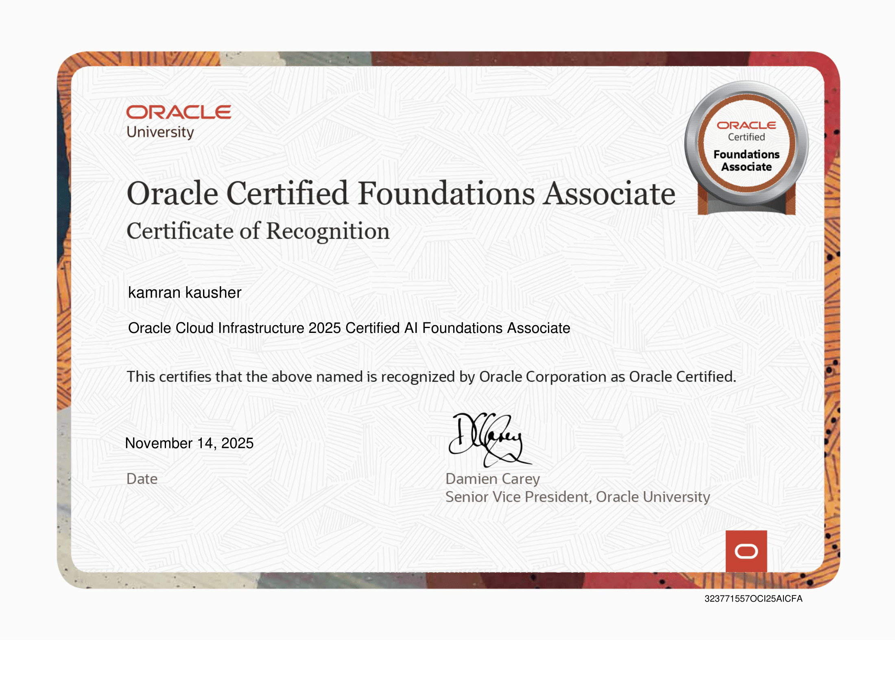
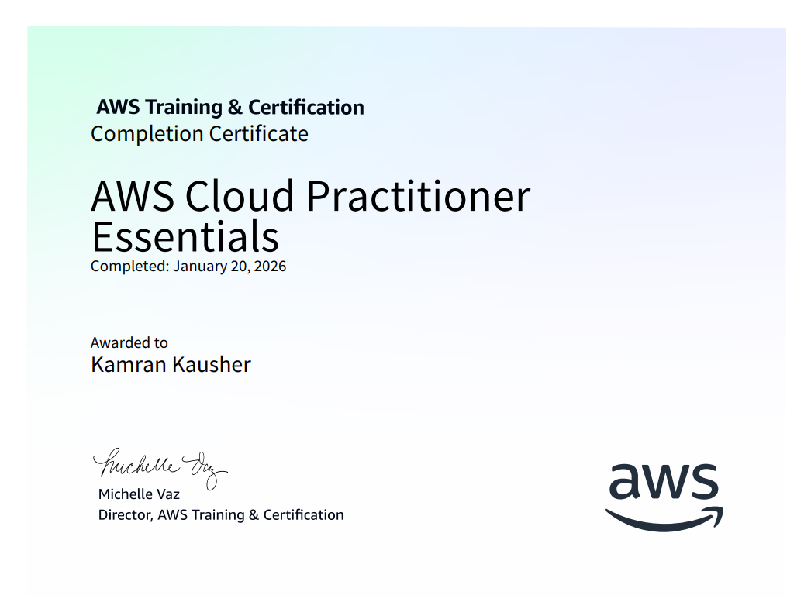
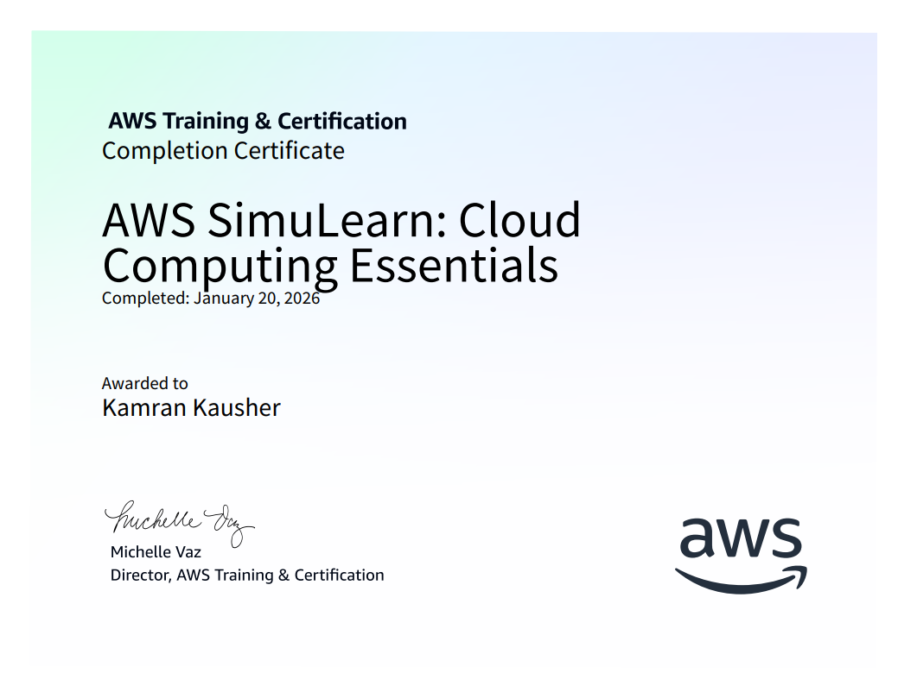
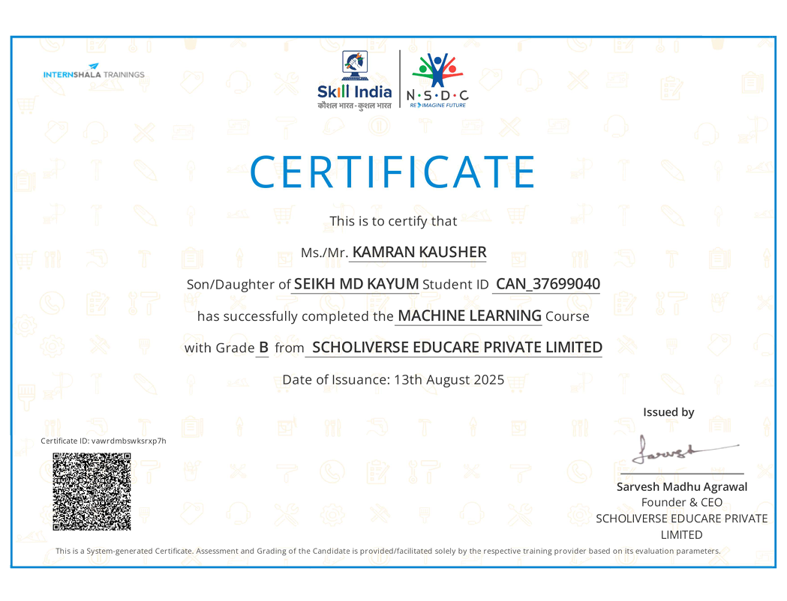
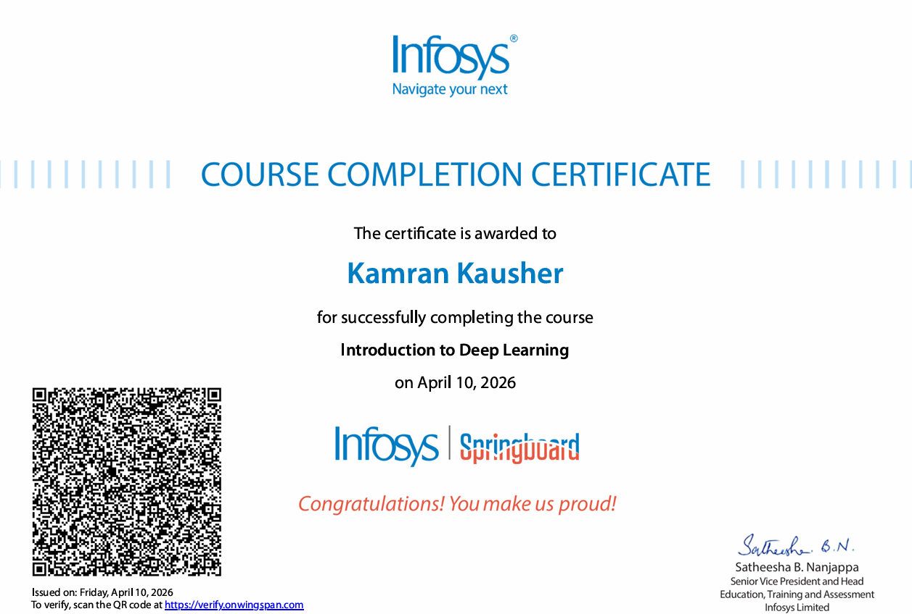
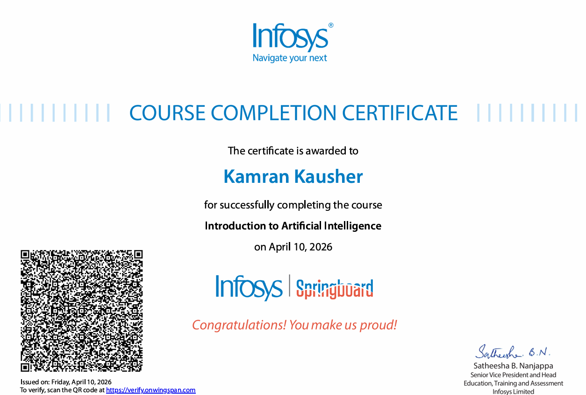
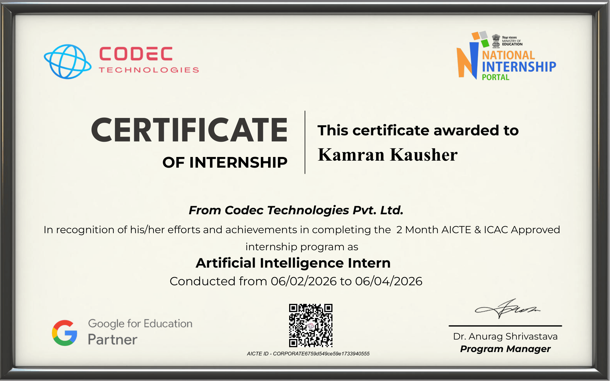
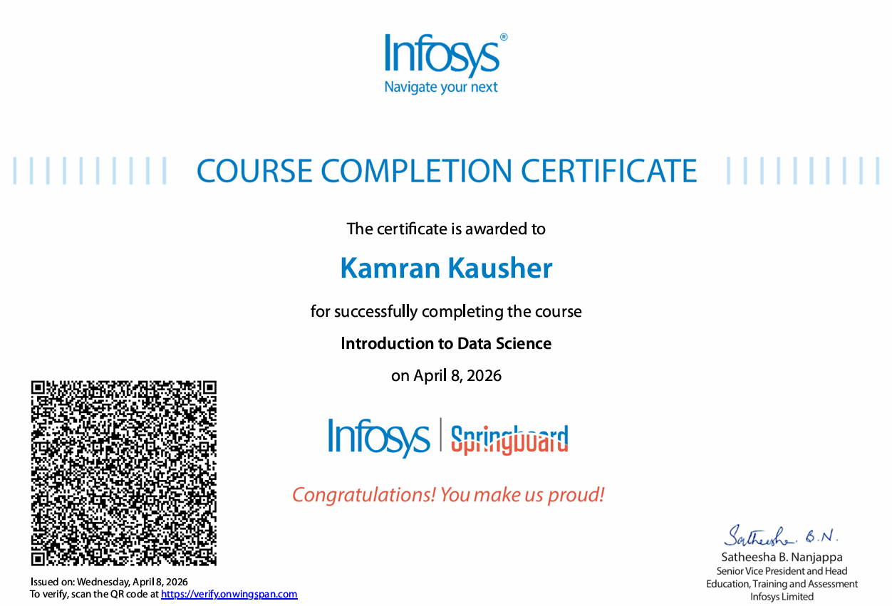
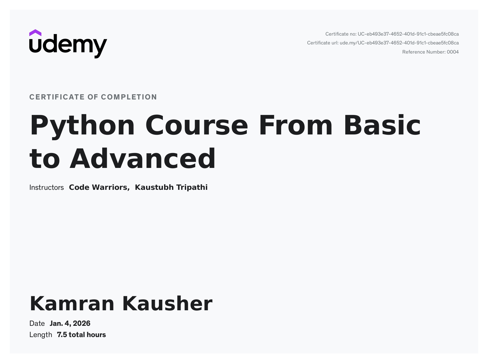
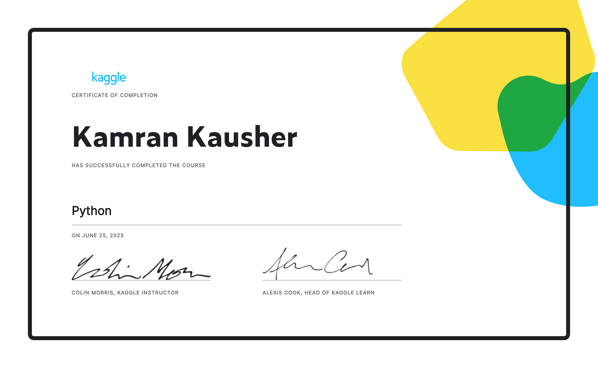

  <!-- Waving Header with Black to Purple Gradient -->
  

  <!-- High-End Typing Effect -->
  

  <!-- High-End Typing Effect -->
  
   
  <i>Empowering the future through intelligence and refined engineering.</i>

---

<table align="center" width="100%" style="border:none;">
<tr>
<td width="60%" valign="top">

## 👑 About

I am a highly motivated **Generative AI Developer and AI Engineer** based in Mumbai. Having completed my B.Tech in Computer Science Engineering (2022 - 2026), my expertise lies in building advanced LLM applications, retrieval-based systems, and rigorous end-to-end machine learning pipelines.

I specialize in translating complex model outputs into explainable, business-ready insights and engineering full-scale applications with real-time inference.

### 🌟 Core Philosophy
- **⚡ Generative AI Pioneer:** Deep, practical expertise in deploying Retrieval-Augmented Generation (RAG) systems, vector embeddings, and semantic LLMs.
- **🧠 Architecture First:** I emphasize maintainable, robust pipelines and cleanly structured code over ad-hoc scripts.
- **🚀 Data to Deployment:** Expert at orchestrating scalable deployments using modern frameworks (FastAPI, REST APIs) to bring AI from notebooks into production-ready cloud environments.

> *"We are moving from a world where we write software to one where we teach it. My mission is to orchestrate that transition with elegance, speed, and precision."*

</td>
<td width="40%" valign="top" align="center">

## 🌌 Connect & Collaborate
  
  
  

 
 
   
  <h3 align="center" style="color:#D4AF37;">Live Statistics</h3>
  

</td>
</tr>
</table>

---

## 🛠️ Technological Arsenal

  

  <h3>🧠 Data Science, ML & Analytics</h3>
  
  
  
  
  
  
  
  
  
  
  
  

  <h3>⚡ GenAI & MLOps</h3>
  
  
  
  

  <h3>🌩️ Cloud, API & Web Architecture</h3>
  
  
  
  
  
  
  
  
  
  
  
  

---

## 💼 Professional Experience

<table align="center" width="100%" style="border:none;">
<tr>
<td valign="top" width="50%">

### **Gen AI Developer**
**Tobbs India** | _Aug 2026 - Present_
- Contributing to Python-based LLM application development, including LLM API integration and AI-enabled backend workflows.
- Supporting retrieval-augmented workflows involving document ingestion, chunking, embeddings, vector retrieval, and source-grounded response generation.
- Assisting with prompt testing, representative test cases, and response-quality checks focused on factual accuracy and hallucination reduction.

</td>
<td valign="top" width="50%">

### **Artificial Intelligence Intern**
**Codec Technologies** | _Feb 2026 - Apr 2026_
- Developed and deployed a content-based movie recommendation system using Python, TF-IDF, Cosine Similarity, Scikit-learn, and REST APIs, serving recommendations across 40,000+ movies with average response latency below 150 ms.
- Optimized recommendation inference using SciPy sparse matrices, reducing memory consumption by 60% while improving inference efficiency and scalability.

</td>
</tr>
</table>

---

## 🚀 Projects

**1. 🧠 Enterprise Policy AI Assistant**
- Built an end-to-end document question-answering application using Google Gemini API, RAG, semantic search, vector embeddings, and ChromaDB for source-grounded responses.
- Developed FastAPI REST endpoints for document ingestion, embedding generation, vector indexing, semantic retrieval, and AI inference.
- Improved response quality through document chunking, retrieval tuning, and source citation; achieved approximately 4.2-second end-to-end response latency.

**2. 📊 Tech Job Market Skill-Gap Analyzer**
- Built an end-to-end data and ML application that analyzes 5,257 English job postings, extracts skills from job descriptions using a custom 200+ skill taxonomy, and compares user skills with market demand.
- Implemented TF-IDF and binary skill-presence features with a Multinomial Logistic Regression classifier to predict five experience levels; achieved 73.29% test accuracy and 0.9184 macro ROC-AUC.
- Added interactive Streamlit dashboards for skill demand by role and experience level, personalized skill-gap analysis, and real-time model inference; included pytest-based unit tests and reusable Python modules.

**3. 📈 E-commerce Growth Intelligence Platform**
- Built an end-to-end customer analytics platform with XGBoost churn prediction, A/B testing, cohort analysis, and RFM segmentation, deployed using FastAPI with Dockerized CI/CD.
- **Tech:** Python · XGBoost · SHAP · Optuna · MLflow · FastAPI · SQLite · SciPy · statsmodels · Pandas · NumPy · scikit-learn · Chart.js · Docker · GitHub Actions · Pytest

**4. GitShield — Developer Security Platform**
- Developed a local-first code security platform that detects vulnerabilities and exposed secrets using AST analysis, entropy heuristics, and a real-time VS Code extension. 
- **Tech:**  Python, Flask, ast, Click, Rich, TypeScript, VS Code Extension API, Shannon Entropy, Regex.

**5. ⚡Revion- Real-Time Demand Intelligence & Dynamic Pricing Platform**
- Built an enterprise-scale demand forecasting and dynamic pricing platform combining forecasting, causal inference, contextual bandits, and anomaly detection with FastAPI deployment and CI/CD.
- **Tech:** Python · LightGBM · scikit-learn · SHAP · statsmodels · SciPy · Pandas · NumPy · MLflow · FastAPI · Streamlit · Docker · GitHub Actions · Pytest · Joblib · Plotly 
  
 
**6. Stock Price Prediction Dashboard**
- Built and deployed an ML-powered stock prediction dashboard with real-time market data, feature engineering, interactive visualization, and cloud deployment.
- **Tech:** Python, Scikit-learn, NumPy, Pandas, Streamlit, yfinance.

**7. Customer Retention Powered by Multi-Agent AI Orchestration**
- Developed a multi-agent AI customer retention platform using LangGraph, XGBoost, SHAP, and LLMs to automate churn analysis and personalized retention strategies.
- **Tech:** Python, LangGraph, Groq API (LLaMA 3), FastAPI, XGBoost, SHAP, React.js (Vite), Framer Motion, Pandas, Scikit-learn, Render, Vercel

  
**8. 🩺 AI Heart Disease Clinical Analyzer**
- Built an ML-powered clinical decision support system that predicts heart disease risk, explains predictions, and generates downloadable patient reports through an interactive web app.
- **Tech:** Python, Scikit-learn, Pandas, NumPy, Streamlit, ReportLab, Joblib

**9. AI Customer Retention Intelligence System by Using Generative Ai**
- Developed an explainable customer churn intelligence system that predicts retention risk and generates actionable business recommendations using SHAP-powered insights.
- **Tech:** Python, Pandas, NumPy, scikit-learn, SHAP, FastAPI, Streamlit, joblib, Matplotlib, Seaborn, Git

**10. Telecom Customer Churn Prediction Pipeline**
- Built an end-to-end telecom churn prediction pipeline with feature engineering, FastAPI REST APIs, and an interactive Streamlit dashboard for real-time predictions.
- **Tech:** Python, Pandas, NumPy, scikit-learn, Matplotlib, Seaborn, FastAPI, Streamlit, joblib, Jupyter Notebook, Git 

**11. Real Estate Price Estimation Engine**
- Developed a machine learning price estimation system with robust preprocessing pipelines and a Streamlit interface for accurate real-time property valuation.
- **Tech:**  Python, Pandas, NumPy, scikit-learn, Matplotlib, Seaborn, Streamlit, joblib, Jupyter Notebook, Git 

---

## 📈 Executive Analytics Center

 

  <!-- 3D Gradient Deep Space Purple and Gold Streak Widget -->
  

 

  <!-- Dynamic Activity Wave Line in Gold on 3D Deep Metallic Purple -->
  

---

## 🏆 Honours and Open Source Trophies

  

---

## 📜 Certifications of Excellence

  
<em>Professional certifications validating expertise in cutting-edge technologies and methodologies.</em>

   

  <h3 align="center">🌩️ Cloud Architecture</h3>
  <table align="center" width="100%" border="1" bordercolor="#D4AF37" bgcolor="#050014" cellpadding="10">
    <tr>
      <td align="center" width="25%" bordercolor="#D4AF37">
        <a href="certificates/oracle.png">
            
          
        </a>
      </td>
      <td align="center" width="25%" bordercolor="#D4AF37">
        <a href="certificates/aws-practitioner.png">
            
          
        </a>
      </td>
      <td align="center" width="25%" bordercolor="#D4AF37">
        <a href="certificates/aws-simulearn.png">
            
          
        </a>
      </td>
      <td align="center" width="25%" bordercolor="#D4AF37">
      </td>
    </tr>
  </table>

   
  <h3 align="center">🧠 Machine Learning & AI</h3>
  <table align="center" width="100%" border="1" bordercolor="#D4AF37" bgcolor="#050014" cellpadding="10">
    <tr>
      <td align="center" width="25%" bordercolor="#D4AF37">
        <a href="certificates/internshala.png">
            
          
        </a>
      </td>
      <td align="center" width="25%" bordercolor="#D4AF37">
        <a href="certificates/infosys-deep-learning.png">
            
          
        </a>
      </td>
      <td align="center" width="25%" bordercolor="#D4AF37">
        <a href="certificates/infosys-nlp.png">
            
          
        </a>
      </td>
      <td align="center" width="25%" bordercolor="#D4AF37">
        <a href="certificates/codec-ml-internship.png">
            
          
        </a>
      </td>
    </tr>
  </table>

   
  <h3 align="center">📊 Data Science & Programming</h3>
  <table align="center" width="100%" border="1" bordercolor="#D4AF37" bgcolor="#050014" cellpadding="10">
    <tr>
      <td align="center" width="25%" bordercolor="#D4AF37">
        <a href="certificates/infosys-data-science.png">
            
          
        </a>
      </td>
      <td align="center" width="25%" bordercolor="#D4AF37">
        <a href="certificates/python.jpg">
            
          
        </a>
      </td>
      <td align="center" width="25%" bordercolor="#D4AF37">
        <a href="certificates/python-programming.png">
            
          
        </a>
      </td>
      <td align="center" width="25%" bordercolor="#D4AF37">
      </td>
    </tr>
  </table>

---

## 💡 Developer Inspiration

  

---

## 🐍 Open Source Contribution Grid

<table align="center" width="100%" border="1" bordercolor="#D4AF37" bgcolor="#050014">
  <tr>
    <td align="center">
      <h3 align="center">365-Day Contribution Overview</h3>
      <!-- Actual Snake SVG -->
      
       
    </td>
  </tr>
</table>

---

### ⭐ Open to internships, collaborations, and AI engineering opportunities

